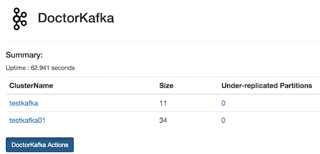

#   &nbsp;&nbsp; Pinterest DoctorKafka

[](https://travis-ci.org/pinterest/doctorkafka)

DoctorKafka is a service for [Kafka] cluster auto healing and workload balancing.  DoctorKafka can automatically detect broker failure and reassign the workload on the failed nodes to other nodes. DoctorKafka can also perform load balancing based on topic partitions's network usage, and makes sure that broker network usage does not exceed the defined settings. DoctorKafka sends out alerts when it is not confident on taking actions.

#### Features   

 * Automated cluster healing by moving partitions on failed brokers to other brokers
 * Workload balancing among brokers
 * Centralized management of multiple kafka clusters

#### Detailed design

Design details are available in [docs/DESIGN.md](docs/DESIGN.md).

## Setup Guide

##### Get DoctorKafka code
```sh
git clone [git-repo-url] doctorkafka
cd doctorkafka
```

##### Build kafka stats collector and deployment it to kafka brokers 

```sh
mvn package -pl kafkastats -am
```

Kafkastats is a kafka broker stats collector that runs on kafka brokers and reports broker stats
to some kafka topic based on configuration. The following is the kafkastats usage.

```sh
usage: KafkaMetricsCollector
 -broker <arg>                      kafka broker
 -disable_ec2metadata               Disable the collection of host information using ec2metadata
 -jmxport <kafka jmx port number>   kafka jmx port number
 -kafka_config <arg>                kafka server properties file path
 -ostrichport <arg>                 ostrich port
 -pollingintervalinseconds <arg>    polling interval in seconds
 -primary_network_ifacename <arg>   network interface used by kafka
 -producer_config <arg>             kafka_stats producer config
 -topic <arg>                       kafka topic for metric messages
 -tsdhostport <arg>                 tsd host and port, e.g.
                                    localhost:18621
 -uptimeinseconds <arg>             uptime in seconds
 -zookeeper <arg>                   zk url for metrics topic
```

The following is a sample command line for running kafkastats collector:

```
java -server \
    -Dlog4j.configurationFile=file:./log4j2.xml \
    -cp lib/*:kafkastats-0.2.4.4.jar \
    com.pinterest.doctorkafka.stats.KafkaStatsMain \
        -broker 127.0.0.1 \
        -jmxport 9999 \
        -topic brokerstats \
        -zookeeper zookeeper001:2181/cluster1 \
        -uptimeinseconds 3600 \
        -pollingintervalinseconds 60 \
        -ostrichport 2051 \
        -tsdhostport localhost:18126 \
        -kafka_config /etc/kafka/server.properties \
        -producer_config /etc/kafka/producer.properties \
        -primary_network_ifacename eth0
```

Using the above command as an example, after the kafkastats process is up, we can check the process stats using ```curl -s ``` command, and view the logs under /var/log/kafkastats.

```
curl -s localhost:2051/stats.txt
```

The following is a sample upstart scripts for automatically restarting kafkastats if it fails:

```description "KafkaStats"
   start on runlevel [2345]
   respawn
   respawn limit 20 5

   env NAME=kafkastats
   env JAVA_HOME=/usr/lib/jvm/java-8-oracle
   env STATSCOLLECTOR_HOME=/opt/kafkastats
   env LOG_DIR=/var/log/kafkastats
   env HOSTNAME=$(hostname)

   script
       DAEMON=$JAVA_HOME/bin/java
       CLASSPATH=$STATSCOLLECTOR_HOME:$STATSCOLLECTOR_HOME/*:$STATSCOLLECTOR_HOME/lib/*
       DAEMON_OPTS="-server -Xmx800M -Xms800M -verbosegc -Xloggc:$LOG_DIR/gc.log \
       -XX:+UseGCLogFileRotation -XX:NumberOfGCLogFiles=20 -XX:GCLogFileSize=20M \
       -XX:+UseG1GC -XX:MaxGCPauseMillis=250 -XX:G1ReservePercent=10 -XX:ConcGCThreads=4 \
       -XX:ParallelGCThreads=4 -XX:G1HeapRegionSize=8m -XX:InitiatingHeapOccupancyPercent=70 \
       -XX:ErrorFile=$LOG_DIR/jvm_error.log \
       -cp $CLASSPATH"
       exec $DAEMON $DAEMON_OPTS -Dlog4j.configuration=${LOG_PROPERTIES} \
                    com.pinterest.doctorkafka.stats.KafkaStatsMain \
                    -broker 127.0.0.1 \
                    -jmxport 9999 \
                    -topic brokerstats \
                    -zookeeper zookeeper001:2181/cluster1 \
                    -uptimeinseconds 3600 \
                    -pollingintervalinseconds 60 \
                    -ostrichport 2051 \
                    -tsdhostport localhost:18126 \
                    -kafka_config /etc/kafka/server.properties \
                    -producer_config /etc/kafka/producer.properties \
                    -primary_network_ifacename eth0
```


##### Customize doctorkafka configuration parameters

Edit `drkafka/config/*.properties` files to specify parameters describing the environment. Those files contain
comments describing the meaning of individual parameters.


#### Create and install jars

```
mvn package -pl drkafka -am 
```

```sh
mvn package
mkdir ${DOCTORKAFKA_INSTALL_DIR} # directory to place DoctorKafka binaries in.
tar -zxvf target/doctorkafka-0.2.4.4-bin.tar.gz -C ${DOCTORKAFKA_INSTALL_DIR}
```

##### Run DoctorKafka
```sh
cd ${DOCTORKAFKA_INSTALL_DIR}

java -server \
    -cp lib/*:doctorkafka-0.2.4.4.jar \
    com.pinterest.doctorkafka.DoctorKafkaMain \
        server dropwizard_yaml_file
```

The above `dropwizard_yaml_file` is the path to a standard [DropWizard configuration file ](https://www.dropwizard.io/1.0.0/docs/manual/configuration.html)
that only requires the following line pointing to your `doctorkafka.properties` path.

```
config:  $doctorkafka_config_properties_file_path
```

##### Customize configuration parameters

Edit `src/main/config/*.properties` files to specify parameters describing the environment.
Those files contain comments describing the meaning of individual parameters.


## Tools
DoctorKafka comes with a number of tools implementing interactions with the environment.

##### Cluster Load Balancer

```bash
cd ${DOCTORKAFKA_INSTALL_DIR}
java -server \
    -Dlog4j.configurationFile=file:drkafka/config/log4j2.xml \
    -cp drkafka/target/lib/*:drkafka/target/doctorkafka-0.2.4.4.jar \
    com.pinterest.doctorkafka.tools.ClusterLoadBalancer \
        -brokerstatstopic  brokerstats \
        -brokerstatszk zookeeper001:2181/cluster1 \
        -clusterzk zookeeper001:2181,zookeeper002:2181,zookeeper003:2181/cluster2 \
        -config ./drkafka/config/doctorkafka.properties \
        -seconds 3600
```
Cluster load balancer balances the workload among brokers to make sure the broker network
usage does not exceed the threshold.


## DoctorKafka UI 

DoctorKafka uses [dropwizard-core module](https://www.dropwizard.io/1.3.5/docs/manual/core.html) and [serving assets](https://www.dropwizard.io/1.3.5/docs/manual/core.html#serving-assets) to provide a web UI. The following is the screenshot from a demo:




## DoctorKafka APIs

The following APIs are available for DoctorKafka:

    - List Cluster
    - Maintenance Mode

Detailed description of APIs can be found [docs/APIs.md](docs/APIs.md)

## Maintainers
  * [Yu Yang](https://github.com/yuyang08)
  * [Henry Cai](https://github.com/HenryCaiHaiying)
  * [Ambud Sharma](https://github.com/ambud)

## Contributors
  * [Brian Gallew](https://github.com/BrianGallew)
  * [Georgios Andrianakis](https://github.com/geoand)
  * [Jaakko Aro](https://github.com/jaakkoo)
  * [Patrick Double](https://github.com/double16)

## License

DoctorKafka is distributed under [Apache License, Version 2.0](http://www.apache.org/licenses/LICENSE-2.0.html).

[Kafka]:http://kafka.apache.org/
[Ostrich]: https://github.com/twitter/ostrich
[OpenTSDB]: http://opentsdb.net/
[statsD]: https://github.com/etsy/statsd/
