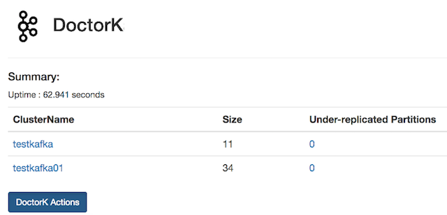

#   &nbsp;&nbsp; Pinterest DoctorK

***ATTENTION: `master` branch now points to DoctorK v3 (0.3.x). The legacy version (0.2.x) can be found under the `0.2.x` branch. 0.3.x uses a YAML configuration that is INCOMPATIBLE with 0.2.x versions.***

DoctorK is a service for [Kafka] cluster auto-healing and workload balancing.  DoctorK can automatically detect broker failure and reassign the workload on the failed nodes to other nodes. DoctorK can also perform load balancing based on topic partitions's network usage, and makes sure that broker network usage does not exceed the defined settings. DoctorK sends out alerts when it is not confident on taking actions.

DoctorK 0.3 introduces a plugin framework to allow users to easily extend DoctorK's Kafka cluster status collection and implementing customized actions. DoctorK's existing functionality is preserved through default plugins.

#### Features

 * Automated cluster healing through auto broker replacement and partition reassignment
 * Workload balancing among brokers
 * Centralized management of multiple kafka clusters
 * Extensible plugin framework to allow customized data collection and customized actions


#### Detailed design

Design details are available in [docs/DESIGN.md](docs/DESIGN.md).

## Setup Guide

##### Get DoctorK code
```sh
git clone https://github.com/pinterest/doctorkafka doctork
cd doctork
```

##### Build KafkaStats metric agent and deploy it to kafka brokers 

```sh
mvn package -pl kafkastats -am
```

KafkaStats is a Kafka broker stats collector that runs on Kafka brokers and reports broker stats
to some Kafka topic based on the configuration. The following is the `kafkastats` usage.

```sh
KafkaMetricsCollector
 -broker <arg>                      # kafka broker
 -disable_ec2metadata               # Disable the collection of host information using ec2metadata
 -jmxport <kafka jmx port number>   # kafka jmx port number
 -kafka_config <arg>                # kafka server properties file path
 -ostrichport <arg>                 # ostrich port
 -pollingintervalinseconds <arg>    # polling interval in seconds
 -primary_network_ifacename <arg>   # network interface used by kafka
 -producer_config <arg>             # kafka_stats producer config
 -topic <arg>                       # kafka topic for metric messages
 -tsdhostport <arg>                 # tsd host and port, e.g. localhost:18621
 -uptimeinseconds <arg>             # uptime in seconds
 -zookeeper <arg>                   # zk url for metrics topic
```

The following is a sample command line for running kafkastats collector:

```
java -server \
    -Dlog4j.configurationFile=file:./log4j2.xml \
    -cp lib/*:kafkastats-0.3.0-rc.3.jar \
    com.pinterest.doctork.stats.KafkaStatsMain \
        -broker 127.0.0.1 \
        -jmxport 9999 \
        -topic brokerstats \
        -zookeeper zookeeper001:2181/cluster1 \
        -uptimeinseconds 3600 \
        -pollingintervalinseconds 60 \
        -ostrichport 2051 \
        -tsdhostport localhost:18126 \
        -kafka_config /etc/kafka/server.properties \
        -producer_config /etc/kafka/producer.properties \
        -primary_network_ifacename eth0
```

Using the above command as an example, after the kafkastats process is up, we can check the process stats using ```curl -s ``` command, and view the logs under /var/log/kafkastats.

```
curl -s localhost:2051/stats.txt
```

The following is a sample upstart scripts for automatically restarting kafkastats if it fails:

```description "KafkaStats"
   start on runlevel [2345]
   respawn
   respawn limit 20 5

   env NAME=kafkastats
   env JAVA_HOME=/usr/lib/jvm/java-8-oracle
   env STATSCOLLECTOR_HOME=/opt/kafkastats
   env LOG_DIR=/var/log/kafkastats
   env HOSTNAME=$(hostname)

   script
       DAEMON=$JAVA_HOME/bin/java
       CLASSPATH=$STATSCOLLECTOR_HOME:$STATSCOLLECTOR_HOME/*:$STATSCOLLECTOR_HOME/lib/*
       DAEMON_OPTS="-server -Xmx800M -Xms800M -verbosegc -Xloggc:$LOG_DIR/gc.log \
       -XX:+UseGCLogFileRotation -XX:NumberOfGCLogFiles=20 -XX:GCLogFileSize=20M \
       -XX:+UseG1GC -XX:MaxGCPauseMillis=250 -XX:G1ReservePercent=10 -XX:ConcGCThreads=4 \
       -XX:ParallelGCThreads=4 -XX:G1HeapRegionSize=8m -XX:InitiatingHeapOccupancyPercent=70 \
       -XX:ErrorFile=$LOG_DIR/jvm_error.log \
       -cp $CLASSPATH"
       exec $DAEMON $DAEMON_OPTS -Dlog4j.configuration=${LOG_PROPERTIES} \
                    com.pinterest.doctork.stats.KafkaStatsMain \
                    -broker 127.0.0.1 \
                    -jmxport 9999 \
                    -topic brokerstats \
                    -zookeeper zookeeper001:2181/cluster1 \
                    -uptimeinseconds 3600 \
                    -pollingintervalinseconds 60 \
                    -ostrichport 2051 \
                    -tsdhostport localhost:18126 \
                    -kafka_config /etc/kafka/server.properties \
                    -producer_config /etc/kafka/producer.properties \
                    -primary_network_ifacename eth0
```


##### Set up configurations

Edit `doctork/config/doctork.config.yaml` file to specify parameters describing your environment.
Some configuration descriptions could be documented in the plugins under `doctork/src/main/java/com/pinterest/doctork/plugins`

Default plugins provided:
- Monitors: (under `doctork/src/main/java/com/pinterest/doctork/plugins/monitor/`)
  1. MaintenanceMonitor
  2. DeadBrokerMonitor
  3. NoBrokerstatsBrokerMonitor
  4. URPMonitor
- Operators: (under `doctork/src/main/java/com/pinterest/doctork/plugins/operator/`)
  1. BrokerReplacementOperator
  2. NoBrokerstatsBrokerOperator
  3. URPReassignmentOperator
- Actions: (under `doctork/src/main/java/com/pinterest/doctork/action/`)
  1. ZkUtilReassignPartitionAction
  2. ScriptReplaceInstanceAction
  3. KafkaReportOperationAction
  4. SendEmailAction
  5. SnoozedSendEmailAction

Detailed configurations for DoctorK, clusters, plugins can be found in the `doctork/config/doctork.config.yaml`

#### Create and install jars

```
mvn package -pl doctork -am 
```

```sh
mvn package
mkdir ${DOCTORK_INSTALL_DIR} # directory to place DoctorK binaries in.
tar -zxvf target/doctork-0.3.0-rc.3-bin.tar.gz -C ${DOCTORK_INSTALL_DIR}
```

##### Run DoctorK
```sh
cd ${DOCTORK_INSTALL_DIR}

java -server \
    -cp lib/*:doctork-0.3.0-rc.3.jar \
    com.pinterest.doctork.DoctorKMain \
        server PATH_TO_DROPWIZARD_YAML_FILE
```

The above `PATH_TO_DROPWIZARD_YAML_FILE` is the path to a standard [DropWizard configuration file ](https://www.dropwizard.io/1.0.0/docs/manual/configuration.html)
that simply points to your doctork configuration file. Generally, the file `doctork/config/doctork.app.yaml` can be used directly without modification.

```yaml
# in doctork/config/doctork.app.yaml
config:  doctork.config.yaml # Your doctork config yaml file
```

## DoctorK UI 

DoctorK uses [dropwizard-core module](https://www.dropwizard.io/1.3.5/docs/manual/core.html) and [serving assets](https://www.dropwizard.io/1.3.5/docs/manual/core.html#serving-assets) to provide a web UI. The following is the screenshot from a demo:



## DoctorK APIs

The following APIs are available for DoctorK:

    - List Cluster
    - Maintenance Mode

Detailed description of APIs can be found in [docs/API.md](docs/API.md)

## Maintainers
  * [Yu Yang](https://github.com/yuyang08)
  * [Henry Cai](https://github.com/HenryCaiHaiying)
  * [Ambud Sharma](https://github.com/ambud)
  * [Ping-Min Lin](https://github.com/kabochya)

## Contributors
  * [Brian Gallew](https://github.com/BrianGallew)
  * [Georgios Andrianakis](https://github.com/geoand)
  * [Jaakko Aro](https://github.com/jaakkoo)
  * [Patrick Double](https://github.com/double16)
  * [Paul Kiernan](https://github.com/paulkiernan)
  * [Brian Sang](https://github.com/Baisang)
  * [Nitin Agrawal](https://github.com/nitin456)

## License

DoctorK is distributed under [Apache License, Version 2.0](http://www.apache.org/licenses/LICENSE-2.0.html).

[Kafka]:http://kafka.apache.org/
[Ostrich]: https://github.com/twitter/ostrich
[OpenTSDB]: http://opentsdb.net/
[statsD]: https://github.com/etsy/statsd/
