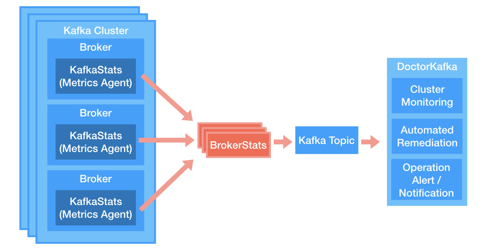
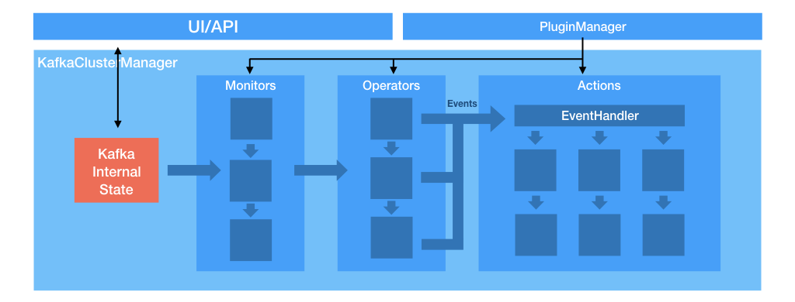
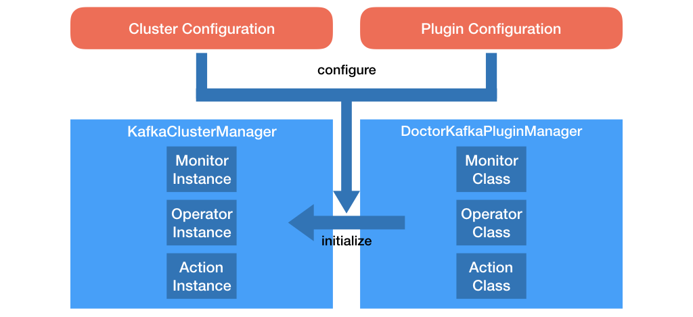
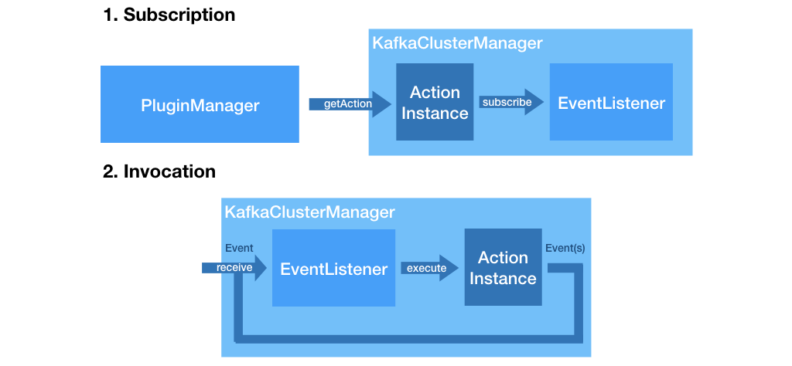
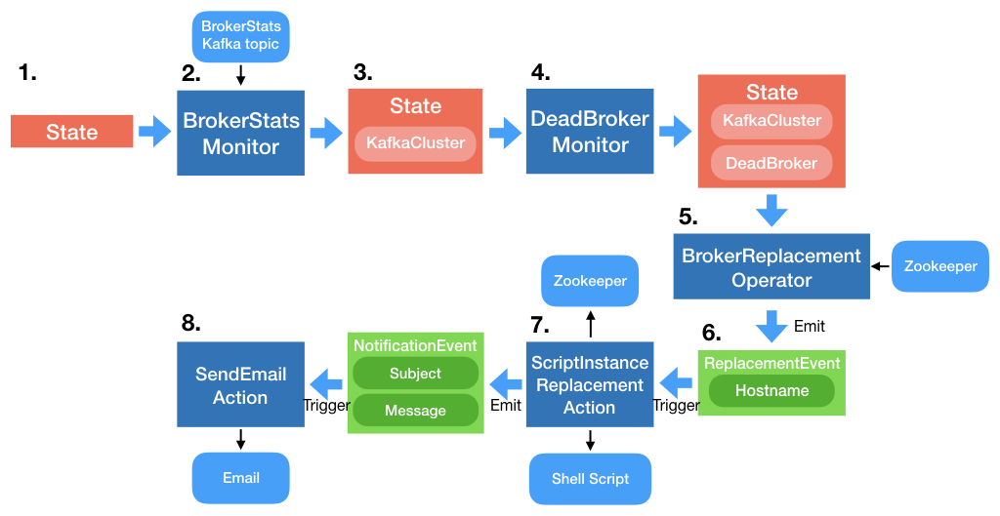

# Pinterest DoctorKafka Design

## High Level Design

The DoctorKafka system is composed of two parts: 
  1.  **KafkaStats Agent**: Metrics collector that is deployed on every kafka broker. KafkaStats then sends metrics to a kafka topic that the central DoctorKafka service read from.
  2.  **DoctorKafka Service**: Central operation automation logic that analyzes broker status and execute kafka operation commands. DoctorKafka takes actions and also logs its action to another topic that can be viewed through web UI.

The following diagram shows the high level design:

## Kafka metrics collection agent (KafkaStats)

DoctorKafka needs accurate kafka metrics to make sound decisions. As Kafka workload is mostly network bounded, DoctorKafka only uses topic partition network traffic metric to decide topic partition allocation. Currently kafka only have jmx metrics at topic level. It does not provide jmx metrics at replica level. Due to partition reassignment, etc., the traffic at topic level can vary a lot. Computing the normal network traffic of replicas becomes a challenge. 

DoctorKafka deploys a metric collection agent on each kafka broker to collect metrics. The metric agent collect the following info for each broker: 
   *  Inbound and outbound network traffic for each leader replica
   *  Leader replicas on the broker
   *  Follower replicas on the broker
   *  In-reassignment topic replica

Note that as of kafka 0.10.2, Kafka only exposes network traffic metrics for leader replicas. As follower replicas only have in-bound traffic, we can infer the follower replica traffic from leader replica traffic. 

## DoctorKafka Service

The DoctorKafka service is a centralized manager that monitors Kafka clusters, detects failures and heals the system autonomously.

### Plugin Framework
Before 0.3.0, DoctorKafka can only use data that is collected by KafkaStats agents to make cluster maintenance decisions, and the cluster maintenance logic is also implemented in a single function. Because of this, it is difficult to extend DoctorKafka to leverage more data sources that can improve maintenance decision making, and to implement customized cluster maintenance actions.

DoctorKafka 0.3.0 introduces a plugin framework that is similar to a [control system](https://en.wikipedia.org/wiki/Control_system). It allows the developers to easily add customized Kafka cluster data collectors, and implement customized maintenance solutions. For instance, we can implement a broker lifecycle management plugin that enables auto replacing brokers that have been scheduled with maintenance events. 

The plugin framework includes three types of plugins:
1. Monitors:
    **Monitors** collects data from external systems and derives internal state of the system-under-interest (i.e. Kafka). The internal state is kept in a HashMap as a generic key-value store which is defined as the **State** of the external system.
    The logic of a **Monitor** plugin is implemented in the `observe(State)` function.
2. Operators:
    **Operators** examine the **State** of the system populated by the **Monitors**. Based on the plugin-defined logic, an Operator might create a plan to perform operations and emit **Events** to trigger **Actions**.
    The logic of an **Operator** plugin is implemented in the `operate(State)` function.
3. Actions:
    **Actions** listens to **Events** emitted by **Operators** or other **Actions** and executes an operation. These operations are interactions to the external system, e.g. replacement of hosts, partition reassignments or sending emails etc.
    The logic of an **Action** plugin is implemented in the `execute(Event)` function.

Currently, each Kafka cluster is managed by a **ClusterManager**. When launching the DoctorKafka service, the **ClusterManagers** read from the configuration file for a list of **Monitors**, **Operators** and **Actions** enabled on each cluster. These plugins are provisioned by a **PluginManager** which combines global configs and cluster-specific configs and sets up the plugins during initialization, and hands the plugin instances off back to the **ClusterManagers**.

After all plugins are initialized, the **ClusterManagers** will start a periodic loop which will go through all the **Monitors** and **Operators** of each cluster. At the beginning of each cycle of the loop, a **ClusterManager** will create a empty **State** object with only the cluster-related configs populated. The **State** will then get populated by the **Monitors** with all the derived enrichments and attributes. Once the **Monitors** are evaluated and the loop wasn't short-circuited, the **State** will be passed on into **Operators** to perform different operations based on the data in the **State**. If an **Operator** decides to perform an operation, it will emit an **Event** that will trigger an **Action**, which will execute an action to do something to the external systems. The **Event** contains all necessary data the downstream **Actions** requires.

Invocation of **Actions** are different from the **Monitor** and **Operator** plugins, both of which are evaluated in a timed loop. **Actions** are executed in a event-driven manner, which allows multiple actions to be triggered at the same time.

As shown as the figure above, once the **Actions** are provisioned by the **PluginManager** and handed to a **ClusterManager**, the **Action** instance will subscribe itself to the **EventListner** with a list of **Events** that are explicitly listed in the configuration file. Once a **ClusterManager** starts the evaluation loop of **Monitors** and **Operators**, the **EventDispatcher** will accept **Events** from **Operators** and execute the **Actions** that have subscribed to the corresponding **Events**. **Actions** themselves can also emit **Events**, thus allowing chained **Actions** and conditional callbacks.

### Example
Now that we have a high-level picture of the components and how they are stiched together, we can take a look at an example flow of the operations. This is what a flow of automated broker replacement for a cluster would look like in the DoctorKafka plugin framework.

Broker Replacement is a crucial operation for healing the cluster, as a dead broker in Kafka will increase the load on other brokers and could even lead to stuck pipelines and data loss if not handled seriously. In this case, we divide the operation into several pieces, which fits into the plugin framework smoothly.

1. The evaluation loop starts, a new **State** containing basic configuration of the cluster is created and passed into plugins.
2. *BrokerStatsMonitor* collects stats send from the KafkaStats agent in a seperate thread and populates the **State** with a internal reconstruction of the current Kafka cluster.
3. The **State** now has a *KafkaCluster* attribute.
4. *DeadBrokerMonitor* analyzes the *KafkaCluster* object passed in by *BrokerStatsMonitor* and infers which brokers are dead in the clusters. It then compiles a list of dead brokers *DeadBrokers* into the **State**.
5. After all **Monitors** have been evaluated, the **Operators** start to be fired. *BrokerReplacementOperator* examines the brokers the *DeadBrokers* list and potentially other brokers that might need to be replaced (e.g. Degraded brokers, Brokers to-be-decommissioned) and chooses a target broker to be terminated and replaced. The **Operator** also checks a Znode in Zookeeper to fetch the record of the previous replacement and makes sure that a user-configured cooldown period has passed before emitting an replacement **Event**. The **Event** contains the hostname of the broker that needs to be replaced.
(The evaluation loop in the **ClusterManager** will end after all the **Operators** have been executed. The **Action** evaluation is done asynchronusly in a different thread.)
6. The replacement **Event** is received by a handler that dispatches the **Event** to subscribed **Actions**, in this case the *ScriptInstanceReplacementAction*.
7. *ScriptInstanceReplacementAction* is triggered by the incoming **Event** and runs a configurable script to replace the host. This is run in a seperate process so that other actions don't get blocked. This plugin also updates the Znode that keeps the previous replacements so that even if DoctorKafka crashes the cooldown period will be enforced. When the script is executed, this plugin will emit another notification **Event** that contains a message that will be sent out.
8. The notification **Event** is handled by the event handler and dispatched to the *SendEmailAction*, which will send an email with the subject and message body wrapped in the notification **Event** to pre-configured email addresses.

## Notes
- DoctorKafka provides a framework that is inspired by a control system. Actions are not guaranteed to be immediately effective thus the system should be considered to be eventually-consistent.
- Plugins in DoctorKafka should be as stateless as possible. Any external state synchronization should be handled by the developer. The *BrokerReplacementOperator* and *ScriptInstanceReplacementAction* plugins has examples of using Zookeeper as the external state datastore.