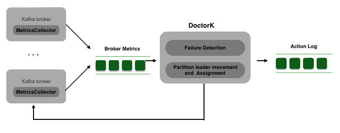

## Pinterest DoctorK Design

#### High Level Design

DoctorK is composed of two parts: 

  * Metrics collector that is deployed to each kafka broker
  * Central doctork service that analyzes broker status and execute kafka operation commands

The following diagram shows the high level design. DoctorK is composed of two parts: i) the metrics collector that deploys on every kafka broker; 2) the central failure detection, workload balancing, and partition reassignment logic. The metric collectors send metrics to a kafka topic that the central DoctorK service read from. DoctorK takes actions and also log its action to another topic that can be viewed through web UI. DoctorK only takes confident actions, and send out alerts when it is not confident on taking actions. 




#### Kafka Metrics collection

DoctorK needs accurate kafka metrics to make sound decisions. As Kafka workload is mostly network bounded, DoctorK only uses topic partition network traffic metric to decide topic partition allocation. Currently kafka only have jmx metrics at topic level. It does not provide jmx metrics at replica level. Due to partition reassignment, etc., the traffic at topic level can vary a lot. Computing the normal network traffic of replicas becomes a challenge. 

DoctorK deploys a metric collection agent on each kafka broker to collect metrics. The metric agent collect the following info for each broker: 
   *  Inbound and outbound network traffic for each leader replica
   *  leader replicas on the broker
   *  follower replicas on the broker
   *  In-reassignment topic replica

Note that as of kafka 0.10.2, kafka only expose network traffic metrics for leader replicas. As follower replicas only have in-bound traffic, we can infer the follower replica traffic from leader replica traffic. 


#### DoctorK cluster manager

The broker workload traffic usually varies throughout the day. Because of this, we need to read broker stats from 24-48 hours time window to infer the traffic of each replica. As partition reassignment does not reflect the noraml workload traffic, we need to exclude partition reassignment traffic during the metric computation. 


###### Algorithm for dead broker healing:

```
    for each under-replicated topic partition tp:
         under-replicated reason → reason list
    if all under-replicated partitions are due to broker failure: 
        for each under-replicated topic partition tp:
            if  exists broker h that satisfies constraints for hosting tp:
                 add [tp → h]  to the partition reassignment plan
            else:
                 send out alerts and exit the procedure 
     execute partition reassignment plan
```

###### Algorithm for balancing the workload among brokers

```
   let (in_limit, out_limit) be the broker's network traffic threshold setting  
   for each broker b : network_out(b) > out_limit or  network_in(b) > in_limit :
      let leader_replias be the leader replicas on b, sorted by traffic in decending order
      while workload(b) > l: 
        select a leader replica that has not been processed
        if  exists follower boker c that has capacity to host tp as leader:
           add [tp,  b → c]  to the preferred leader election list
        else if exist borker h that satisfies constraints for hosting tp:
           add [tp → h] to partition reassignment list
        else:
             send out alerts and exit             
    execute leader movement and partition reassignment
```                     

***


